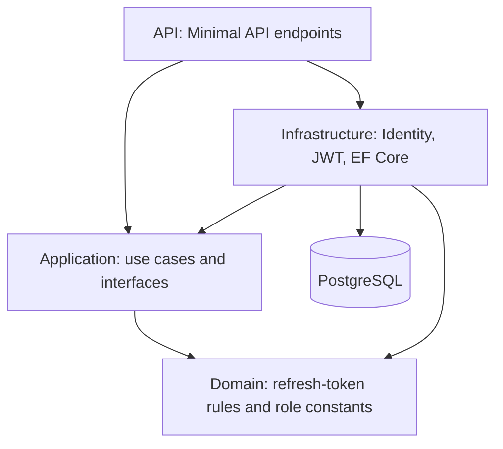

# IdentityHub

IdentityHub is a .NET 10 authentication API built to demonstrate how user registration, JWT authentication, and renewable sessions fit together in a layered backend. Its core focus is the refresh-token lifecycle: rotation, reuse detection, bounded session lifetimes, and revocation across multiple logins.

The solution separates HTTP contracts, application use cases, domain rules, and infrastructure. It includes PostgreSQL persistence, a Docker development environment, unit and API integration tests, and a GitHub Actions build-and-test workflow.

## Features

- Register users through ASP.NET Core Identity and assign the default `User` role.
- Authenticate with email and password and issue JWT access tokens plus opaque refresh tokens.
- Rotate refresh tokens on every successful refresh.
- Detect reuse of revoked refresh tokens and revoke the user's active refresh tokens across sessions.
- Combine sliding refresh expiry with an absolute session limit.
- Log out using a refresh token, or revoke all active refresh tokens using an authenticated request.
- Read the authenticated user's ID, email, and roles through `/users/me`.
- Return validation problems and Problem Details for application failures.
- Generate an OpenAPI document in Development.

This repository implements a focused authentication backend. It does not expose administrative provisioning or role-management endpoints, an OAuth/OIDC protocol server, or a frontend.

## Architecture



| Project | Responsibility |
| --- | --- |
| `IdentityHub.API` | Request/response contracts, endpoint mapping, authentication middleware, error mapping, and application startup. |
| `IdentityHub.Application` | Registration, login, refresh, logout, and logout-all use cases; service/repository interfaces; results and authentication options. |
| `IdentityHub.Domain` | Refresh-token issuance, expiry and revocation rules, plus role constants. No external package dependencies. |
| `IdentityHub.Infrastructure` | ASP.NET Core Identity adapters, JWT generation/validation, EF Core repositories, migrations, and role seeding. |

Application use cases depend on `IIdentityService`, `ITokenService`, and `IRefreshTokenRepository`. Infrastructure provides their implementations. The API composes these services through dependency injection; endpoints translate use-case results into HTTP responses.

## Authentication and security

### Credentials and roles

ASP.NET Core Identity manages users and password hashes. The configured password policy requires:

- At least 12 characters.
- Uppercase and lowercase letters, a digit, and a non-alphanumeric character.
- At least two unique characters.

Registration uses the email as both username and email. Duplicate registration with the same email is covered by an API test; the implementation relies on Identity's username uniqueness rather than an explicitly configured unique-email requirement.

Startup seeds `User` and `Admin` roles. Registration assigns `User`; it does not create an administrator. If role assignment fails, registration attempts to delete the newly created user as compensation. That rollback is best effort, rather than a shared database transaction.

### Access tokens

Access tokens are signed with HMAC-SHA256 and contain `sub` (user ID), `email`, `jti`, and `role` claims. Bearer validation checks issuer, audience, signing key, and lifetime; accepts only HMAC-SHA256; and uses zero clock skew. Inbound claim mapping is disabled so endpoints use the original claim names.

`/users/me` reads these claims from the token, rather than querying the user's current database record. Email and roles therefore reflect the issued token. Refresh retrieves the current email and roles before creating a new access token.

### Refresh-token rotation

Refresh tokens are Base64-encoded values generated from 64 cryptographically random bytes. Each login creates a separate refresh-token record and starts a new session.

On a successful refresh:

1. Load the submitted token and reject invalid, revoked, expired, or absolutely expired sessions.
2. Fetch the user's email and roles and generate a new token pair.
3. Preserve the original `SessionStartedAt` on the replacement refresh token.
4. Revoke the previous token and record the replacement value in `ReplacedByToken`.
5. Add the replacement and persist both changes with one `SaveChangesAsync` call.

The replacement expiry is calculated as:

```text
min(now + RefreshTokenLifetimeDays,
    original SessionStartedAt + AbsoluteRefreshTokenLifetimeDays)
```

The Development configuration uses a **15-minute access token**, a **7-day refresh window**, and a **30-day absolute session limit**. Refresh cannot revive an already expired token. The initial login token uses the configured refresh lifetime directly; the absolute cap is checked during refresh.

### Reuse detection

Submitting any stored, revoked refresh token to `/auth/refresh` triggers the reuse response. The use case revokes **all currently active refresh tokens for that user**, saves the revocations even though the request fails, and returns `401`.

This response spans independent logins; it is not restricted to a replacement chain. The implementation checks revocation before expiry and does not distinguish rotation from logout. Consequently, refreshing a token revoked by logout also triggers user-wide revocation.

Unknown, expired, revoked, and absolutely expired refresh tokens share the application error `Tokens.InvalidRefreshToken`. Invalid login credentials share `Users.InvalidCredentials` for unknown users and incorrect passwords.

Clients should replace their stored refresh token after a successful refresh and avoid submitting an old token again. Concurrent refresh requests are not protected by an explicit concurrency token or locking mechanism in this repository; exactly-one-success behavior under simultaneous requests is not established by the tests.

### Logout semantics

| Operation | Behavior |
| --- | --- |
| `POST /auth/logout` | Accepts a refresh token without requiring an access token. Revokes that specific stored token if it is not already revoked. Unknown or already revoked tokens are no-ops; the endpoint returns `204`. It does not follow `ReplacedByToken` to revoke a successor. |
| `POST /auth/logout-all` | Requires a valid bearer access token. Uses its `sub` claim to revoke every active refresh token belonging to that user, with one save. Returns `204`, including when there are no active tokens. |

**Already issued access tokens remain valid until their expiry.** Logout and reuse detection revoke renewable sessions; the API does not maintain an access-token denylist or perform per-request security-stamp checks.

## API endpoints

JSON property names use camel case. Protected endpoints accept `Authorization: Bearer <accessToken>`.

| Method | Path | Authentication | Request | Responses from implemented handlers |
| --- | --- | --- | --- | --- |
| `POST` | `/auth/register` | None required | `email`, `password` | `201` with `userId`; `400` validation problem on registration failure. |
| `POST` | `/auth/login` | None required | `email`, `password` | `200` with token pair; `401` Problem Details on invalid credentials. |
| `POST` | `/auth/refresh` | Refresh token in body | `refreshToken` | `200` with replacement token pair; `401` Problem Details on rejected refresh. |
| `POST` | `/auth/logout` | Refresh token in body | `refreshToken` | `204`. |
| `POST` | `/auth/logout-all` | Bearer token | No body | `204`; `401` when unauthenticated. |
| `GET` | `/users/me` | Bearer token | No body | `200` with `userId`, `email`, and `roles`; `401` when unauthenticated. |
| `GET` | `/openapi/v1.json` | None required | No body | OpenAPI document, available only in Development. |

Login and refresh return this shape; token values below are placeholders and lifetimes illustrate the default login configuration:

```json
{
  "accessToken": "<JWT>",
  "refreshToken": "<opaque refresh token>",
  "accessTokenExpiresInSeconds": 900,
  "refreshTokenExpiresInSeconds": 604800,
  "tokenType": "Bearer"
}
```

Refresh-token lifetime returned by refresh may be shorter near the absolute session limit. Login and refresh failures include an `errorCodes` array in Problem Details. Registration failures group Identity errors by code in a validation-problem response. Malformed requests and unexpected exceptions may produce additional framework-level errors.

## Tech stack

| Area | Technology |
| --- | --- |
| Runtime and API | C#, .NET 10, ASP.NET Core Minimal APIs |
| User and role storage | ASP.NET Core Identity with GUID identifiers |
| Persistence | Entity Framework Core 10 and Npgsql |
| Database | PostgreSQL 18 Alpine in Compose and CI |
| Tokens | JWT bearer authentication, Microsoft.IdentityModel.JsonWebTokens, HMAC-SHA256 |
| API description | ASP.NET Core OpenAPI |
| Tests | xUnit, NSubstitute, WebApplicationFactory, Coverlet collector |
| Packaging and CI | Multi-stage Dockerfile, Docker Compose, GitHub Actions |

Exact package versions are recorded in the project files. The local EF CLI tool is pinned to `10.0.9` in `.config/dotnet-tools.json`.

## Run locally

Run commands from the repository root, where `IdentityHub.slnx` and `compose.yaml` live.

### Option 1: API and database in Docker

Requirements: Docker with a running daemon and Docker Compose v2. A host .NET SDK is not needed for this option.

```bash
docker compose up --build -d postgres api
docker compose logs -f api
```

The API is available at `http://localhost:8080`; the development OpenAPI document is at `http://localhost:8080/openapi/v1.json`.

Compose starts PostgreSQL, waits for its health check, and runs the API in Development. The API applies migrations and seeds roles before accepting requests. The container connection string uses the Compose hostname `postgres`.

```bash
docker compose down
```

The main database persists in the named `identityhub-pgdata` volume. `docker compose down` retains that volume.

### Option 2: API on the host, PostgreSQL in Docker

Requirements: .NET 10 SDK, plus Docker and Compose for PostgreSQL. A separately managed PostgreSQL instance can also be used if its connection string is configured accordingly.

```bash
docker compose up -d postgres
dotnet restore IdentityHub.slnx
dotnet build IdentityHub.slnx
dotnet run --project src/IdentityHub.API --launch-profile http
```

The `http` launch profile sets Development and serves the API at `http://localhost:5022`. Its OpenAPI document is at `http://localhost:5022/openapi/v1.json`. The `https` profile also specifies `https://localhost:7175` and requires a usable development certificate.

The supplied Rider HTTP client environment points to port `8080`. Adjust `src/IdentityHub.API/http-client.env.json` to port `5022` when using the host launch profile. Example requests are in `src/IdentityHub.API/IdentityHub.API.http`; some comments in that file predate the current implementation.

### Database and configuration

| Setting | Development value |
| --- | --- |
| Host database | `localhost:5432`, database `identityhub` |
| Test database | `localhost:5433`, database `identityhubtest` |
| Local database credentials | Username `postgres`, password `postgres` |
| Connection-string key | `ConnectionStrings:Default` |
| JWT issuer / audience | `IdentityHub` / `IdentityHub.Clients` |
| JWT secret key | `Authentication:Jwt:Secret` |

Development settings are in `src/IdentityHub.API/appsettings.Development.json`. Environment variables can override configuration using double underscores, such as `ConnectionStrings__Default` and `Authentication__Jwt__Secret`.

The base `appsettings.json` does not supply database or JWT settings. Running outside Development requires providing them. JWT options require issuer, audience, and a secret of at least 32 characters; token lifetimes are range-validated at startup. The committed JWT secret and database credentials are development values.

Migrations run automatically at startup in every environment. For explicit migration management, the repository includes a local EF tool manifest:

```bash
dotnet tool restore
# macOS/Linux: load the development configuration for the startup project
ASPNETCORE_ENVIRONMENT=Development dotnet ef database update \
  --project src/IdentityHub.Infrastructure \
  --startup-project src/IdentityHub.API
```

### Try the authentication flow

Use port `8080` for Docker or `5022` for the host HTTP profile:

```bash
curl -i http://localhost:8080/auth/register \
  -H 'Content-Type: application/json' \
  -d '{"email":"demo@example.com","password":"DemoPassword123!"}'

curl -s http://localhost:8080/auth/login \
  -H 'Content-Type: application/json' \
  -d '{"email":"demo@example.com","password":"DemoPassword123!"}'
```

Copy the returned token values into the following requests:

```bash
curl http://localhost:8080/users/me \
  -H 'Authorization: Bearer <accessToken>'

curl http://localhost:8080/auth/refresh \
  -H 'Content-Type: application/json' \
  -d '{"refreshToken":"<refreshToken>"}'

curl -i -X POST http://localhost:8080/auth/logout-all \
  -H 'Authorization: Bearer <accessToken>'
```

## Testing

The supplied source contains **49 xUnit `[Fact]` tests** across four test projects:

| Project | Tests | Coverage focus |
| --- | ---: | --- |
| `IdentityHub.Domain.Tests` | 7 | Refresh-token issuance guards, state, and revocation. |
| `IdentityHub.Application.Tests` | 20 | Login, rotation, invalid/expired tokens, absolute expiry, reuse response, logout, logout-all, and result invariants. |
| `IdentityHub.Infrastructure.Tests` | 4 | JWT claims, issuer/audience/signature, configured expiry, and random refresh-token format. |
| `IdentityHub.API.Tests` | 18 | HTTP registration/login/refresh/logout flows, protected endpoints, reuse invalidating a replacement, and logout across two sessions. |

API tests use `WebApplicationFactory` with a real PostgreSQL database. The factory hardcodes `localhost:5433`, database `identityhubtest`, and credentials `postgres`/`postgres`; it does not provision its own database container.

```bash
docker compose up -d postgres-test
# Wait until postgres-test is healthy before running the suite.
docker compose ps postgres-test
dotnet test IdentityHub.slnx
```

The API test fixture deletes users and related authentication data from its configured test database during initialization. Use the dedicated test database. Its Compose service has no configured named data volume.

Unit tests can be run without PostgreSQL:

```bash
dotnet test tests/IdentityHub.Domain.Tests
dotnet test tests/IdentityHub.Application.Tests
dotnet test tests/IdentityHub.Infrastructure.Tests
```

Coverlet collectors are included in the test projects; optional coverage collection is available with:

```bash
dotnet test IdentityHub.slnx --collect:"XPlat Code Coverage"
```

The test count describes the supplied source, not an independently verified passing run. The archive does not contain a test-run report.

## Continuous integration

`.github/workflows/ci.yml` defines one `build-test` job on `ubuntu-latest`, triggered by pushes to `main` and pull requests targeting `main`.

The job starts a health-checked `postgres:18-alpine` service with `identityhubtest` mapped to port `5433`, installs .NET `10.0.x`, and runs:

```bash
dotnet restore
dotnet build --no-restore --configuration Release
dotnet test --no-build --configuration Release --verbosity normal
```

The workflow builds and tests the solution. It does not deploy the API, publish Docker images, or upload coverage. A live CI result cannot be established from the workflow file alone.

## Project structure

```text
IdentityHub.slnx
src/
  IdentityHub.API/
    Endpoints/Auth/                 # Authentication HTTP contracts and routes
    Endpoints/Users/                # Current-user endpoint
    Common/Extensions/             # Required claim extraction
  IdentityHub.Application/
    Features/                      # Register, Login, RefreshTokens, Logout, LogoutAll
    Common/                        # Interfaces, options, results, errors, models
  IdentityHub.Domain/
    Entities/RefreshToken.cs        # Session and token state rules
    Constants/UserRoles.cs
  IdentityHub.Infrastructure/
    Identity/                      # Identity adapter and JWT services
    Persistence/                   # DbContext, repository, mappings, migrations
    RoleSeeder.cs
    InfrastructureInitializerExtensions.cs
tests/
  IdentityHub.API.Tests/
  IdentityHub.Application.Tests/
  IdentityHub.Domain.Tests/
  IdentityHub.Infrastructure.Tests/
.github/workflows/ci.yml
.config/dotnet-tools.json
compose.yaml
Dockerfile
```

## Key design decisions and current boundaries

- **Separate authentication workflows from transport and persistence.** Small use-case classes express behavior through interfaces, while Minimal API handlers own HTTP response mapping.
- **Keep token state in the domain.** Issuance validates required identifiers and timestamps; expiry includes the exact expiry instant; revocation is idempotent. Persistence enforces unique token values and cascades refresh-token deletion when a user is deleted.
- **Inject time.** Use cases and token generation use `TimeProvider`, allowing fixed clocks in tests without waiting for real expiration.
- **Preserve session origin through rotation.** `SessionStartedAt` supports an absolute cap even as refresh expiry slides. Its migration backfills existing records from `CreatedAt`.
- **Persist revocation on rejected reuse.** A failed refresh can still require a database write because the rejection also ends other renewable sessions.
- **Keep logout predictable.** Single-token logout is idempotent; logout-all identifies the user through an authenticated subject claim and saves bulk revocations once.

The current implementation stores refresh-token values directly in PostgreSQL, including replacement values; it does not hash them at rest. Revoked records remain available for reuse detection, and no token-cleanup job is included. Rotation has no explicit concurrency protection, and logout-all revokes the active tokens fetched by that request rather than establishing a permanent block on new logins.

There are no implemented flows for email confirmation, password reset, MFA, external login, or public role administration. Login directly checks passwords with `UserManager.CheckPasswordAsync`; failed-attempt tracking and lockout enforcement are not implemented in that path. The API also contains no rate-limiting or CORS configuration, Swagger UI, HTTPS-redirection middleware, or HSTS setup. Docker's supplied development endpoint uses HTTP.

These boundaries make the project a demonstrable authentication implementation with explicit tradeoffs; they should be reviewed before adapting it for a production service.

## License

[MIT](LICENSE) — Copyright © 2026 Juha Anttila.
